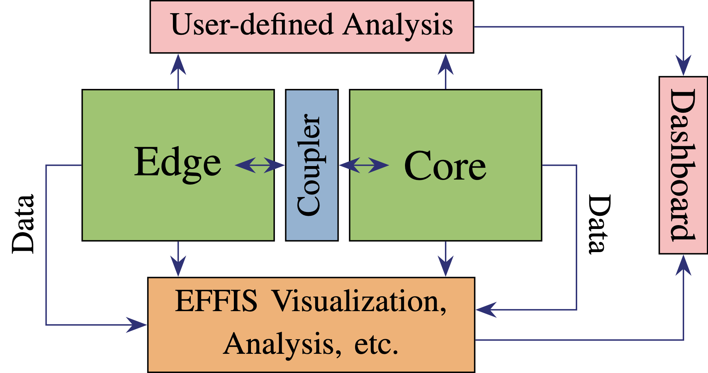
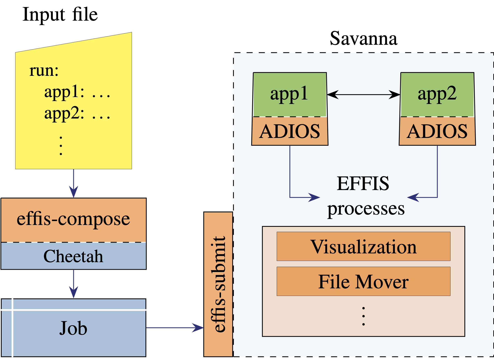

# EFFIS

The Exascale Framework for High Fidelity coupled Simulations (EFFIS) is a workflow and code coupling framework developed as part of the Whole Device Modeling Application (WDMApp) in the Exascale Computing Project. EFFIS consists of a library, command line utilities, and a collection of run-time daemons. Together, these software products enable users to easily compose and execute workflows that include: strong or weak coupling, in situ (or offline) analysis/visualization/monitoring, command-and-control actions, remote dashboard integration, and more.



EFFIS applications/services operate within the publish/subscribe data movement paradigm. Data producers “put” sets of variables that can then be accessed by one or more consumers in a “get.” Typically EFFIS applications have employed [ADIOS](https://github.com/ornladios/ADIOS2) for the actual data movement, and EFFIS is well connected with the ADIOS infrastructure.

Currently EFFIS leverages the [Cheetah framework](https://github.com/CODARcode/cheetah/tree/dev/codar) as its composition and run-time execution back-ends. The framework acts a tool for creating jobs in a uniform format across HPC sites, as well as an execution engine for running on the compute nodes.




Job composition in EFFIS is done through a YAML configuration file, with a simple primer example included below. 

```yaml
# Top-level job settings
jobname: xgc-DIIID				# jobname: Sets the job name for scheduler
walltime: 7200					# walltime: Wall time to request for job (in seconds)
rundir: /dir/to/job/output		# rundir: Top directory for job output


# Site-specific submissions settings
machine:
  name: summit		# name: Platform where workflow runs
  charge: fus123	# charge: Account to charge node-hours
  

# What codes to run and how
run:

  xgc:
    processes: 48                     # processes: Number of MPI ranks
    processes-per-node: 6             # processes-per-node: Number of MPI ranks per node
    cpus-per-process: 7               # cpus-per-processes: Number of cores per MPI rank
    "gpu:rank": "1:1" 
    executable_path: /path/to/exe     # execuatable_path: File path of executable to run
  
  viz:
    processes: 1
    processes-per-node:1
    executable_path: /my/python/viz
```


Other hooks exist for:

- Input file configuration
- Node sharing
- Streaming
- Performance monitoring
- Dashboard integration
- Data backup, archiving, site migration


<!--
# Overview

Welcome to the EFFIS (2.0) documentation. EFFIS is a code coupling integration suite.
It uses [ADIOS](https://github.com/ornladios/ADIOS2)  to move data between applications and provides job composition support on DOE ECP type machines 
with a simple YAML interface.

Some examples of extensions that EFFIS provide beyond ADIOS alone are:

- Switch between file-based and in-memory data movement (coupling or general output) without any changes
- Automatic step seeking
- Identical job creation on different platforms
- Automated plotting (e.g. to be connected to a dashboard)
- Performance timing
- Source code, input configuration, etc. capture
-->

# Topics
The help pages are organized into subtopics linked below.

* [Installation](doc/installation.md)
* [Code integration](doc/integration.md)
* [Using the pre-processor](doc/preprocessor.md)
* [Job Composition](doc/composition.md)

